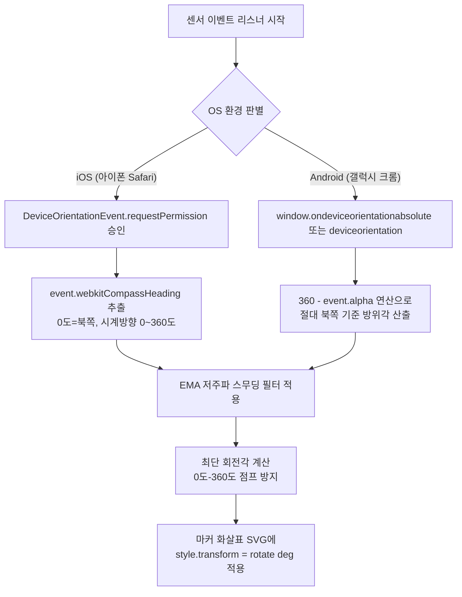

# 스마트폰 방향 센서 기반 360도 내비게이션 화살표 마커 구현 계획

## 1. 개요 및 요구사항 정의

### 1.1 배경 및 목적
* **유저 피드백**: 지도상의 내 위치 마커가 단순한 파란색 원(동그라미)으로만 표시되어, 내가 지금 어느 방향을 바라보고 걷고 있는지 알기 어려움.
* **개선 목표**:
  * 기존 파란 원 마커를 **핸드폰이 가리키는 방향을 나타내는 '360도 회전 내비게이션 화살표'**로 개편.
  * 스마트폰의 센서(중력/자이로/나침반 센서) 데이터를 실시간 감지하여, 사용자가 몸을 돌리거나 폰을 회전할 때 화살표가 실시간으로 부드럽게 360도 회전하도록 구현.
  * 실제 티맵, 카카오맵, 네이버지도 앱의 도보 내비게이션과 동일한 수준의 시각적 경험 제공.

---

## 2. API 공식 가이드 조사 및 기술 검토

### 2.1 카카오맵 JavaScript API v2 가이드 조사 결과
* **기본 `Marker` 객체의 한계**:
  * 카카오 지도 Web API 공식 문서에 따르면, 기본 `kakao.maps.Marker` 객체는 자체적인 회전(rotation) 속성이나 방위각(heading) 제어 API를 제공하지 않습니다.
* **카카오 공식 권장 솔루션 (`kakao.maps.CustomOverlay`)**:
  * 카카오 개발자 센터 공식 가이드에서는 마커를 회전시키거나 실시간 방향을 제어할 때 **`CustomOverlay`를 사용할 것을 명시적으로 권장**합니다.
  * `CustomOverlay`의 `content`로 HTML/SVG 요소를 주입한 뒤, CSS `transform: rotate(${heading}deg)` 속성을 동적으로 업데이트하여 360도 회전시키는 방식입니다.
  * **현재 우리 프로젝트 상태**: 이미 `userOverlay`가 `CustomOverlay`로 구현되어 있으므로, 기존 아키텍처를 해치지 않고 SVG 디자인과 회전 CSS만 연결하면 완벽하게 호환됩니다.

### 2.2 TMAP API 가이드 조사 결과
* **TMAP 마커 회전 정책**:
  * TMAP Open API(Web JS V2/V3) 역시 기본 마커에 자체적인 실시간 회전 프로퍼티가 없으며, DOM 기반의 Custom Marker나 CSS `transform: rotate()`를 사용하도록 안내하고 있습니다.
* **우리 서비스 아키텍처와의 관계**:
  * 현재 우리 서비스에서 TMAP은 지도를 렌더링하는 용도가 아니라, Vercel Serverless 백엔드(`/api/pedestrian-route.js`)를 통해 **보행자 도보 경로(좌표 배열)를 계산해 오는 엔진**으로만 사용하고 있습니다.
  * 따라서 화면 위의 마커 렌더링과 센서 기반 360도 회전 처리는 **100% 카카오맵 `CustomOverlay`와 웹 표준 센서 API**를 통해 구현됩니다.

---

## 3. 스마트폰 센서(중력/자이로/나침반) 데이터 획득 메커니즘

### 3.1 센서 원리: 왜 단순 중력(Gravity) 센서만으로는 안 될까?
* 스마트폰에서 '내가 어느 방향(동서남북)을 바라보고 있는가'를 알기 위해서는 **지자기 센서(Magnetometer, 나침반)**와 **가속도계(중력 센서, Gravity)**, **자이로스코프(Gyroscope)** 3가지가 OS 차원에서 융합된 **`DeviceOrientation` 센서 퓨전** 데이터를 사용해야 합니다.
* 중력 센서만으로는 폰이 기울어진 각도(Pitch, Roll)만 알 수 있고, 폰이 수평으로 북쪽을 보는지 남쪽을 보는지(Heading, Yaw)는 나침반/자이로 센서가 함께 작동해야 360도 측정이 가능합니다.

### 3.2 웹 브라우저 표준 센서 이벤트 (`DeviceOrientationEvent`)



#### ① iOS (아이폰 Safari / 크롬)
* **방위각 프로퍼티**: `event.webkitCompassHeading`
  * 북쪽을 0°로 하여 시계 방향으로 0° ~ 360°의 정확한 진북/자북 방위각을 제공합니다.
* **보안 정책 (iOS 13+)**:
  * 페이지가 로드되자마자 백그라운드에서 센서를 켤 수 없으며, **사용자의 명시적 제스처(버튼 터치)** 시점에 `DeviceOrientationEvent.requestPermission()`을 호출해야 합니다.
  * **전략**: 사용자가 맨 처음 누르는 **[📍 내 위치로 찾기 (허용)]** 모달 버튼이나 **[길찾기]** 버튼 클릭 핸들러에 권한 요청 로직을 자연스럽게 결합하여 유저에게 별도의 팝업 피로감을 주지 않습니다.

#### ② Android (갤럭시 크롬 등)
* **방위각 프로퍼티**: `window.addEventListener('deviceorientationabsolute', ...)` 우선 사용.
* `event.webkitCompassHeading`이 없는 경우, `event.alpha`를 활용하여 절대 방위각(`(360 - event.alpha) % 360`)으로 변환합니다.
* 안드로이드는 별도의 JS 권한 팝업 없이 HTTPS 환경에서 즉시 센서 접근이 가능합니다.

---

## 4. 핵심 엔지니어링 문제 해결 방안 (품질 최적화)

### 4.1 문제 1: 센서 떨림(Jittering) 현상
* **문제점**: 손으로 스마트폰을 가만히 쥐고 있어도 센서 내부 노이즈와 주변 미세 전자기장 때문에 화살표가 1~2도 단위로 바들바들 떨려 어지러움을 유발합니다.
* **해결책**: **EMA (Exponential Moving Average, 지수 이동 평균) 저주파 필터** 적용.
  ```javascript
  // alphaFactor = 0.15 (센서 반응 속도와 부드러움의 황금 비율)
  smoothedHeading = smoothedHeading + 0.15 * delta;
  ```
  * 이렇게 처리하면 떨림이 완전히 사라지고, 실제 내비게이션 앱처럼 묵직하고 부드럽게 돌아갑니다.

### 4.2 문제 2: 0° ↔ 360° 경계 회전 점프 현상
* **문제점**: 사용자가 북쪽을 기준으로 359°에서 1°로 살짝 돌릴 때, 컴퓨터는 +2° 우회전하는 게 아니라 반대로 358°를 역회전(시계 반대 방향으로 한 바퀴 빙글 돌기)해 버리는 버그가 발생합니다.
* **해결책**: **최단 회전각(Shortest Angle) 공식** 적용.
  ```javascript
  let diff = (targetHeading - currentHeading + 540) % 360 - 180;
  currentHeading += diff * 0.15;
  ```
  * 이 공식을 사용하면 359°에서 1°로 넘어갈 때 자연스럽게 +2°만 우회전합니다.

---

## 5. UI/UX 디자인 상세 (화살표 마커 디자인)

### 5.1 마커 구조 (SVG Vector)
* **외형**:
  1. **중심 코어**: 내 현재 위치를 정확히 짚어주는 파란색 원 (`w-4 h-4 bg-brand-500 rounded-full border-2 border-white shadow-md`).
  2. **전방 시야각/화살표**: 내가 바라보는 전방을 선명하게 가리키는 샤프한 내비게이션 삼각 화살표(Navigation Arrow Beam).
  3. **외곽 펄스 링**: 은은하게 퍼지는 파란색 원형 펄스 애니메이션을 배경에 유지하여 "내 위치"임을 한눈에 인지.
* **CSS 가속**:
  * `will-change: transform;` 및 `transform-origin: center center;`를 적용하여 모바일 GPU 하드웨어 가속(60fps)으로 배터리 소모 없이 부드럽게 렌더링.

---

## 6. 단계별 구현 계획 (Step-by-Step Execution Plan)

### Step 1: 마커 SVG 디자인 및 CSS 교체
* `index.html` 내의 `renderUserMarker()` 함수 수정:
  * 기존 단순 원형 HTML을 **방향 회전 전용 SVG 화살표 래퍼(`id="user-heading-pointer"`)**가 포함된 구조로 교체.

### Step 2: 방향 센서 컨트롤러(`OrientationController`) 모듈 작성
* `startOrientationTracking()` 함수 구현:
  * iOS Safari 권한 확인(`requestPermission`) 로직.
  * `deviceorientationabsolute` 및 `deviceorientation` 크로스 브라우징 이벤트 리스너 등록.

### Step 3: 각도 보정 및 스무딩 알고리즘 적용
* 최단각 회전 알고리즘 및 EMA 필터 함수 결합.
* `requestAnimationFrame`을 통해 초당 60프레임으로 화살표 DOM의 `transform = rotate(${deg}deg)`를 매끄럽게 업데이트.

### Step 4: 사용자 동의 인터랙션 연결
* 기존 위치 허용 모달(`btn-allow-location`) 및 길찾기 시작(`btn-start-nav`) 버튼에 센서 권한 요청 트리거를 자연스럽게 연동.

### Step 5: 실기기(iOS Safari / 갤럭시 크롬) 테스트 및 검증
* 실외에서 폰을 360도 천천히 회전시키며 화살표가 실제 나침반 북쪽/바라보는 방향과 일치하는지 확인.
* 0도 경계선 회전 점프 여부 및 손떨림 방지 스무딩 체감 점검.

---

## 7. 결론 및 향후 진행 방향
* 카카오맵의 공식 권장 방식인 `CustomOverlay` + CSS `transform: rotate` 방식을 사용하므로 **기존 코드와 완벽하게 조화되며 매우 안정적**입니다.
* 사용자가 코드를 수정하지 말라고 명시하였으므로, 현재는 본 기획서 작성을 완료하고 대기합니다.
* 승인 시 안전하게 `Step 1`부터 점진적으로 구현을 진행할 수 있습니다.
