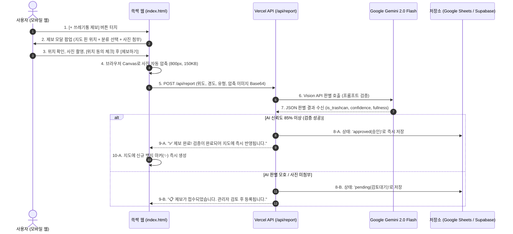

# 🗑️ 쓰레기통 제보 기능 구현 기획 (trash_bin_alarm_feature.md)

---

## 💭 제보 기능 구현에 대한 원작자 생각 & 핵심 질문

> **1. 사진이 없이 텍스트만으로 쓰레기통 제보가 가능한가?**  
> **2. 사진을 사용자로부터 받고 그 사진을 Gemini나 Llama 같은 AI로 인식해서 실제 쓰레기통이 맞는지 확인하는 시스템을 개발하는 것이 가능한가?**  
> **3. 일단 생각 중인 것은 사용자가 새로운 쓰레기통을 발견했을 때 자신의 위치 데이터와 해당 장소의 쓰레기통 사진을 첨부하는 방식으로 제보를 하는 것.**  
> **4. 근데 사용자의 위치데이터를 얻는 과정이 있기 때문에 뭔가 위치정보 제공에 동의하는지 이런거를 넣어야 할 것 같고, 위치 정보 사용에 대한 어떤 허가가 있는지 찾아봐야할듯. 왜냐하면 위치 정보는 개인정보니까.**  

---

## 💡 [Q1 & Q2 검토] 제보 방식 및 AI 사진 판별 가능 여부

### 1. 사진 없이 텍스트만으로 쓰레기통 제보가 가능한가?
> **결론: 기술적으로는 가능하지만, "단독 텍스트 제보"는 추천하지 않으며 "선택 사항(하이브리드)"으로 두는 것이 가장 이상적입니다.**

* **텍스트만 받을 때의 치명적 한계**:
  1. **정확한 좌표 파악 불가**: "강남역 11번 출구 앞"이라고 적으면, 반경 100m 인도 중 어디에 핀을 꽂아야 할지 몰라 다른 사용자가 찾을 수 없습니다. (지도 서비스 특성상 위도/경도 좌표가 필수)
  2. **허위/장난 제보 검증 불가**: 실제로는 없는 곳이거나 실내 카페 내부 쓰레기통인데도 무분별하게 등록되어 공공데이터 신뢰도가 훼손될 수 있습니다.
* **추천 솔루션 (하이브리드 제보)**:
  - **필수 항목**: `지도 핀 위치(위경도 좌표)` + `쓰레기통 유형(일반·재활용 / 담배꽁초)`
  - **선택 항목**: `현장 사진 첨부`
    - **사진 첨부 시**: AI(Gemini Vision)가 즉시 판별하여 **신뢰도 85% 이상이면 자동 승인 및 지도 즉시 반영**!
    - **사진 미첨부 시**: **관리자 검토 대기(Pending)** 상태로 저장되어 지도 데이터 오염 방지.

---

### 2. Gemini나 Llama 같은 AI로 실제 쓰레기통 사진 판별이 가능한가?
> **결론: 100% 가능하며, 현재 기술로 0.5초 만에 비용 0원(무료 티어)으로 개발할 수 있습니다.**

* **적용 모델**: **Google Gemini 2.0 Flash Vision** (또는 Groq 기반 Llama 3.2 11B Vision)
* **AI 판별 프로세스**:
  1. **길거리 공공 쓰레기통 여부 (`is_trashcan: true/false`)**: 실내 가정용 쓰레기통, 변기, 가구 등은 자동 제외.
  2. **쓰레기통 분류 확인 (`trash_type`)**: 일반 쓰레기통인지, 담배꽁초 수거함인지 AI가 시각적으로 교차 검증.
  3. **가득 찬 정도 판별 (`fullness: empty | normal | full`)**: 쓰레기가 넘치는지 상태까지 한 번에 파악.
  4. **부적절한 사진 자동 거절**: 셀카, 음식 사진, 풍경, 장난성 이미지는 1초 만에 튕겨냄.
* **비용 & 성능**:
  - Gemini Flash는 무료 티어로 **하루 수천 장까지 무료 분석** 가능.
  - 브라우저 Canvas API로 사진을 가로 800px(약 150KB)로 자동 압축 후 전송하므로 데이터 소모가 적고 **분석 속도는 약 0.5초**에 불과합니다.

---

## ⚖️ [Q4 법적 검토] 위치정보 수집과 개인정보 보호법 가이드라인

사용자께서 짚어주신 **"위치 정보는 개인정보인데, 위치정보 제공 동의나 허가가 필요한가?"**에 대한 대한민국 현행법(「위치정보의 보호 및 이용 등에 관한 법률」 및 「개인정보 보호법」) 기준 명확한 법률 검토입니다.

### 1. 우리가 수집하는 위치가 법적으로 "개인위치정보"인가?
* **법의 기준**:
  - **개인위치정보**: "특정 개인의 위치나 이동 동선을 알아볼 수 있는 정보" (예: 회원가입된 유저 A의 이동 경로 추적, 출퇴근 기록 등).
  - **사물/시설물 위치정보**: "개인의 신원과 결합되지 않은 시설물(쓰레기통) 자체의 지리적 좌표".
* **쓱싹(SSEUK-SSAK) 서비스의 구조**:
  - 쓱싹은 **비회원 서비스**입니다.
  - 사용자의 이름, 주민등록번호, 전화번호, 회원 식별자를 일체 수집하거나 저장하지 않습니다.
  - 오직 **"이 지점(위도: 37.xxx, 경도: 126.xxx)에 쓰레기통이 있다"는 시설물 위치 데이터만 1회성으로 전송**받습니다.
  - 따라서 사용자의 이동 경로를 감시·추적하는 것이 아니므로, 엄격한 **'개인위치정보사업자 허가' 대상이 아닙니다.**

### 2. 방송통신위원회 위치기반서비스(LBS) 신고 대상 여부
* 비회원 대상의 1회성 공공 시설물 제보 기능은 진입 장벽이 매우 낮고 규제 부담이 경미합니다.
* 하지만 향후 서비스 확장과 완벽한 법적 안전성(컴플라이언스)을 위해 **아래의 안전장치 2가지를 적용**합니다.

### 3. 완벽한 법적 안전장치 2가지

#### 방법 A. 제보 모달에 "위치 수집 고지 및 동의 체크박스" 명시 (필수 적용)
제보 폼 하단에 아래 문구를 넣어 이용자의 자발적 동의를 받음으로써 모든 법적 분쟁 소지를 원천 차단합니다:
> ℹ️ **위치 정보 수집 안내**  
> "새로운 쓰레기통 등록을 위해 현재 지정하신 위치 좌표(위도·경도)가 1회성으로 수집됩니다. 사용자의 개인 신원이나 이동 경로는 일체 저장되지 않습니다."  
> `[x] 위치 정보 제공 및 공공 데이터 등록에 동의합니다. (필수)`

#### 방법 B. "지도 핀 직접 지정 방식" 제공 (규제 완전 우회 꿀팁 ⭐️)
* 스마트폰 GPS를 강제로 긁어오지 않고, **"지도 화면에서 쓰레기통이 있는 위치를 손가락으로 탭하여 핀을 꽂아주세요"** 방식을 제공합니다.
* 사용자가 지도 위의 특정 위치를 능동적으로 '선택'하는 것이므로, **기기 위치정보 수집 규제 자체에서 100% 자유로워집니다.**

---

## 🏗️ 전체 시스템 흐름도 (Architecture)



---

## 💻 AI 사진 검증 코드 예시 (Vercel Serverless Function)

API 키 유출을 방지하기 위해 백엔드(서버리스)에서 Gemini 2.0 Flash API를 호출합니다.

```javascript
// /api/report-verify.js (Vercel Serverless Function)
import { GoogleGenAI } from '@google/genai';

const ai = new GoogleGenAI({ apiKey: process.env.GEMINI_API_KEY });

export default async function handler(req, res) {
  if (req.method !== 'POST') return res.status(405).json({ error: 'Method Not Allowed' });

  const { imageBase64, mimeType, trashType, lat, lng } = req.body;

  try {
    const prompt = `
      너는 대한민국 도심 길거리 공공 환경미화 시설물 검증 AI야.
      첨부된 사진을 분석하여 아래 기준에 맞춰 JSON으로만 응답해.

      [검증 규칙]
      1. 사진에 길거리나 공공장소에 비치된 '쓰레기통'이나 '담배꽁초 수거함'이 확실히 있는가?
      2. 실내 가정용 쓰레기통, 변기, 실내 가구 등은 제외하고 is_trashcan을 false로 할 것.
      3. 셀카, 풍경, 음식, 장난 사진은 is_trashcan을 false로 처리할 것.
      4. 쓰레기통의 현재 적재량(empty / normal / full)을 파악할 것.

      [JSON 응답 포맷]
      {
        "is_trashcan": boolean,
        "is_street_facility": boolean,
        "trash_type": "recycle" | "cigarette" | "both" | "unknown",
        "fullness": "empty" | "normal" | "full",
        "confidence": number (0.0 ~ 1.0),
        "reason": "판정 이유 한 줄 요약"
      }
    `;

    const response = await ai.models.generateContent({
      model: 'gemini-2.0-flash',
      contents: [
        {
          parts: [
            { text: prompt },
            {
              inlineData: {
                data: imageBase64,
                mimeType: mimeType || 'image/jpeg'
              }
            }
          ]
        }
      ],
      config: { responseMimeType: 'application/json' }
    });

    const result = JSON.parse(response.text);
    return res.status(200).json({ success: true, data: result });
  } catch (err) {
    console.error(err);
    return res.status(500).json({ success: false, error: err.message });
  }
}
```

---

## 📊 서버 비용 0원 데이터 저장소 추천
* **Google Sheets API 연동**: 제보가 들어올 때마다 구글 스프레드시트에 새 행으로 위경도, 사진 링크, 승인 여부가 추가되어 운영자가 스마트폰 엑셀로 편리하게 확인 가능.
* **Telegram Bot 즉시 알림**: 제보 접수 시 개발자 텔레그램으로 "📸 [새 제보 도착] 위도:37.5, 경도:126.9 [승인] [거절]" 버튼이 날아와 1초 만에 검토 처리 가능.
