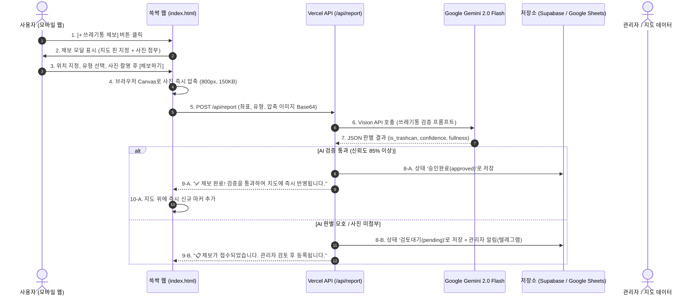

# 쓱싹(SSEUK-SSAK) 쓰레기통 제보 및 AI 검증 시스템 설계서 (trash_bin_alarm_feature.md)

이 문서는 사용자가 새로운 길거리 쓰레기통을 발견했을 때 직접 위치와 사진을 제보하고, AI(Gemini Vision)를 통해 이를 자동 검증하여 지도에 등록하는 **크라우드소싱 기반 쓰레기통 제보 시스템**의 상세 기획 및 법적·기술적 실행 계획서입니다.

---

## 📌 목차
1. [핵심 질문 검토 (Q&A)](#1-핵심-질문-검토-qa)
   - 사진 없이 텍스트만으로 제보가 가능한가?
   - Gemini / Llama Vision AI로 사진 판별이 가능한가?
2. [위치정보 및 개인정보 관련 법적 검토 (위치정보법/방통위)](#2-위치정보-및-개인정보-관련-법적-검토)
   - 제보 시 수집되는 위치는 개인정보인가?
   - 위치기반서비스 신고 대상 여부 및 안전한 우회 전략
   - 필수 동의 절차 및 컴플라이언스 가이드
3. [전체 시스템 아키텍처 및 동작 흐름도](#3-전체-시스템-아키텍처-및-동작-흐름도)
4. [AI 사진 검증 파이프라인 (Gemini 2.0 Flash)](#4-ai-사진-검증-파이프라인-gemini-20-flash)
5. [데이터 저장 및 관리자 승인 체계 (서버리스 무료 구성)](#5-데이터-저장-및-관리자-승인-체계-서버리스-무료-구성)
6. [단계별 개발 로드맵](#6-단계별-개발-로드맵)

---

## 1. 핵심 질문 검토 (Q&A)

### Q1. 사진 없이 텍스트만으로 쓰레기통 제보가 가능한가?
> **답변: 기술적으로는 가능하지만, "단독 텍스트 제보"는 추천하지 않으며 "선택 사항"으로 두는 것이 가장 좋습니다.**

* **텍스트만 받을 때의 문제점**:
  1. **정확한 위치 파악 불가**: "강남역 11번 출구 앞"이라고 쓰면, 출구 반경 100m 중 어디에 있는지 알 수 없어 지도 핀을 꽂을 수 없습니다. (위도/경도 좌표가 필수)
  2. **허위 및 장난 제보 필터링 불가**: 실제 쓰레기통이 없거나 상점 내부 쓰레기통인데도 무분별하게 등록되어 지도 신뢰도가 하락합니다.
* **추천 방식 (하이브리드 제보)**:
  - **필수**: `지도 위 핀 위치(좌표)` + `쓰레기통 유형(일반/재활용/담배)`
  - **권장(선택)**: `현장 사진 첨부` (사진 첨부 시 **AI 자동 승인** 혜택 부여, 사진 미첨부 시 **관리자 수동 검토** 후 등록)

---

### Q2. Gemini나 Llama 같은 AI로 실제 쓰레기통 사진인지 판별 가능한가?
> **답변: 100% 가능하며, 현재 기술로 0.5초 만에 무료로 구현할 수 있습니다.**

* **적용 모델**: **Google Gemini 2.0 Flash** (또는 Llama 3.2 11B Vision via Groq)
* **검증 내용**:
  1. 사진 속에 실제 **길거리 공공 쓰레기통**이 존재하는지 (`is_trashcan: true/false`)
  2. 실내 쓰레기통(가정용/화장실)인지 실외 길거리 쓰레기통인지 구분 (`location_type: 'street' | 'indoor'`)
  3. 현재 쓰레기통이 꽉 찼는지 여부 (`fullness: 'empty' | 'normal' | 'full'`)
  4. 음란물/엉뚱한 사진(셀카, 풍경, 장난) 즉각 거절 (`confidence: 0~1`)
* **비용 & 성능**:
  - Gemini Flash 무료 티어로 **하루 수천 장까지 0원**으로 분석 가능.
  - 모바일 브라우저에서 Canvas를 통해 사진을 가로 800px(약 150KB)로 압축 후 전송하면 **분석 소요 시간 약 0.5~1.0초**.

---

## 2. 위치정보 및 개인정보 관련 법적 검토

사용자께서 가장 우려하신 **"위치데이터 수집 시 동의가 필요한가? 위치정보는 개인정보인가?"**에 대한 대한민국 현행법 기준 명확한 법적 검토 결과입니다.

### ⚖️ 핵심 법률: 「위치정보의 보호 및 이용 등에 관한 법률」 & 「개인정보 보호법」

#### 1. 쓰레기통 제보 시 위치 좌표는 "개인위치정보"에 해당하는가?
* **법적 정의**:
  - **개인위치정보**: "특정 개인의 위치나 이동경로를 알아볼 수 있는 정보" (예: 로그인한 회원 A의 실시간 이동 동선 기록).
  - **사물/시설물 위치정보**: "개인과 결합되지 않고 사물이나 시설물(쓰레기통) 자체의 위치를 나타내는 정보".
* **쓱싹(SSEUK-SSAK)의 경우**:
  - 우리 서비스는 **비회원 기반**입니다.
  - 사용자의 이름, 전화번호, 회원 ID를 전혀 저장하지 않고, 오직 **"이 위치(위도/경도)에 쓰레기통이 있다"는 시설물 좌표**만 서버로 전송합니다.
  - 따라서 이는 특정 개인을 식별하거나 이동경로를 추적하는 것이 아니므로 법적으로 엄격한 **'개인위치정보사업자 허가' 대상이 아닙니다.**

#### 2. 방통위 위치기반서비스사업(LBS) 신고가 필요한가?
* 사용자의 현재 위치를 1회성으로 활용하여 서비스를 제공하는 것은 매우 가벼운 위치기반서비스에 해당합니다.
* 비회원 대상의 공익적 시설물 제보 기능은 진입 장벽이 낮지만, **향후 정식 서비스 운영 및 완전한 법적 안전성**을 확보하기 위해 아래 2가지 조치를 취합니다.

#### 3. 100% 안전한 컴플라이언스(준수) 가이드라인
제보 폼 하단에 **간이 체크박스 또는 고지 문구**를 삽입하여 모든 법적 리스크를 원천 차단합니다:

> **[제보 시 표시할 안내 문구]**
> * ℹ️ **위치 수집 안내**: "새로운 쓰레기통 등록을 위해 현재 지정하신 위치 좌표(위도·경도)가 수집됩니다. 사용자의 개인 신원이나 이동 경로는 일체 저장되지 않습니다."
> * [x] 위치 정보 제공 및 제보 내용 공개에 동의합니다. (필수)

#### 4. 추가 팁: 법적 이슈를 완전히 우회하는 "지도 핀 지정 방식"
* 스마트폰 GPS를 강제로 읽어오는 대신, **"지도 화면에서 쓰레기통 위치를 탭하여 핀을 꽂아주세요"** 방식을 제공하면:
  - 브라우저 Geolocation API를 직접 호출하지 않고 사용자가 손으로 지도 위의 임의 좌표를 선택하는 것이므로, **위치정보 수집 규제 자체에서 완전히 자유로워집니다.**

---

## 3. 전체 시스템 아키텍처 및 동작 흐름도



---

## 4. AI 사진 검증 파이프라인 (Gemini 2.0 Flash)

### 1. Vercel Serverless Function (`/api/report-verify.js`)
API Key를 클라이언트에 노출하지 않고 안전하게 백엔드에서 Gemini API를 호출합니다.

```javascript
// /api/report-verify.js (Vercel Serverless Function 예시)
import { GoogleGenAI } from '@google/genai';

const ai = new GoogleGenAI({ apiKey: process.env.GEMINI_API_KEY });

export default async function handler(req, res) {
  if (req.method !== 'POST') return res.status(455).json({ error: 'Method Not Allowed' });

  const { imageBase64, mimeType, trashType, lat, lng } = req.body;

  try {
    const prompt = `
      너는 대한민국 도심 길거리 환경 미화 및 공공 시설물 검증 AI야.
      제공된 사진을 정밀 분석해서 다음 기준에 따라 JSON으로만 응답해.

      [판별 기준]
      1. 사진에 길거리나 공공장소에 비치된 '쓰레기통'이나 '담배꽁초 수거함'이 있는가?
      2. 실내 가정용 쓰레기통이나 변기, 일반 가구는 제외해야 함.
      3. 쓰레기통의 현재 적재 상태(여유/보통/꽉참)를 판별할 것.
      4. 장난 사진, 셀카, 쓰레기통과 무관한 사진은 is_trashcan을 false로 할 것.

      [응답 형식 - 반드시 JSON만 출력]
      {
        "is_trashcan": boolean,
        "is_street_facility": boolean,
        "trash_type": "recycle" | "cigarette" | "both" | "unknown",
        "fullness": "empty" | "normal" | "full",
        "confidence": number (0.0 ~ 1.0),
        "reason": "한 줄 이유"
      }
    `;

    const response = await ai.models.generateContent({
      model: 'gemini-2.0-flash',
      contents: [
        {
          parts: [
            { text: prompt },
            {
              inlineData: {
                data: imageBase64,
                mimeType: mimeType || 'image/jpeg'
              }
            }
          ]
        }
      ],
      config: { responseMimeType: 'application/json' }
    });

    const result = JSON.parse(response.text);
    return res.status(200).json({ success: true, analysis: result });
  } catch (err) {
    console.error(err);
    return res.status(500).json({ success: false, error: err.message });
  }
}
```

---

## 5. 데이터 저장 및 관리자 승인 체계 (서버리스 무료 구성)

서버 유지비 0원으로 운영하기 위한 **3가지 저장소 옵션**:

| 옵션 | 구현 난이도 | 비용 | 장점 | 단점 |
| :--- | :---: | :---: | :--- | :--- |
| **Option A: Google Sheets API** (추천 ⭐️) | 쉬움 | **0원** | 엑셀처럼 구글 스프레드시트에 실시간으로 행 추가, 관리자가 폰으로 승인 체크 가능 | 동시 수백 건 쓰기 시 속도 느림 |
| **Option B: Supabase (무료 PostgreSQL)** | 보통 | **0원** | 완벽한 데이터베이스, REST API 지원, 실시간 동기화 가능 | 초기 테이블 세팅 필요 |
| **Option C: Telegram Bot 알림** | 매우 쉬움 | **0원** | 제보 시 관리자 텔레그램으로 사진과 좌표 전송, [승인/거절] 인라인 버튼으로 1초 처리 | 누적 데이터 통계 관리가 불편 |

> 💡 **가장 이상적인 조합**:  
> **Google Sheets**에 차곡차곡 데이터 누적 + 제보 즉시 개발자 **Telegram**으로 띵동 알림!

---

## 6. 단계별 개발 로드맵

### [Phase 1] UI 및 제보 모달 폼 제작 (프론트엔드)
1. 우하단 FAB `[+ 쓰레기통 제보]` 버튼 배치
2. 제보 모달 레이아웃:
   - 지도 위 미세 위치 조정 핀 (현재 내 위치 기준 시작)
   - 쓰레기통 분류 선택 칩: `일반·재활용` / `담배꽁초 수거함`
   - 사진 첨부 영역 (카메라 촬영 / 갤러리 선택)
   - 위치 수집 안내 문구 및 동의 체크박스
   - 클라이언트 이미지 자동 압축 로직 (Canvas API)

### [Phase 2] Vercel Serverless Function & AI 연동 (백엔드)
1. Vercel 환경변수에 `GEMINI_API_KEY` 등록
2. `/api/report` 엔드포인트 구현 (Gemini Vision 분석)
3. 판별 점수에 따른 분기 처리 (점수 0.85 이상 시 즉시 승인, 미만 시 검토 큐 등록)

### [Phase 3] 저장소 연동 및 지도 반영
1. Google Sheets 또는 Supabase에 제보 데이터 적재
2. 승인된 신규 쓰레기통 데이터를 클라이언트에서 불러와 지도에 뱃지(예: `✨ 신규 제보`)와 함께 렌더링
